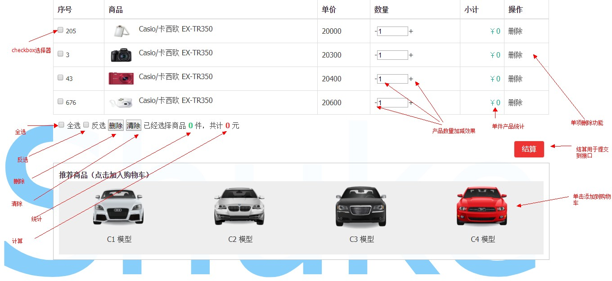

#  8月第6期 javascript 阶段项目考核
    项目时间：201810 - 20180907
    提交方式：QQ邮箱 liyiruo@gmail.com
    项目及基础知识笔记要打压缩包ZIP发到邮箱
    答辩时间 安排 ： 20181015 - 20181022
    
## 效果图

### 购物车 商品 id 商品	单价	数量	小计
>        var prolist=[
            {id:"205",pro:"Casio/卡西欧 EX-TR350",pic:"images/1.jpg",price:"20000",count:"25"},
            {id:"3",pro:"Casio/卡西欧 EX-TR350",pic:"images/2.jpg",price:"20300",count:"25"},
            {id:"43",pro:"Casio/卡西欧 EX-TR350",pic:"images/3.jpg",price:"20400",count:"25"},
            {id:"676",pro:"Casio/卡西欧 EX-TR350",pic:"images/4.jpg",price:"20600",count:"25"}
        ];

### 推荐商品
>    var goodslist=[
        {id:"33",pro:"C1 模型",pic:"images/b1.png",price:"200",count:"25"},
        {id:"345",pro:"C2 模型",pic:"images/b2.png",price:"209",count:"25"},
        {id:"5456",pro:"C3 模型",pic:"images/b3.png",price:"230",count:"25"},
        {id:"567576",pro:"C4 模型",pic:"images/b4.png",price:"260",count:"25"}
    ];

### 相关功能 
一，购物车产品，及推荐产品 输出到元素   
二，全选，反选  
三，删除操作，  
四，增加操作  
五，价格，数量的计算；  
六，提交功能   

 

